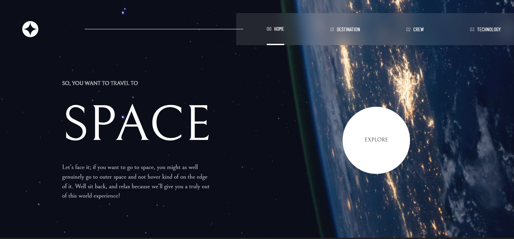

# Frontend Mentor - Space tourism website solution

This is a solution to the [Space tourism website challenge on Frontend Mentor](https://www.frontendmentor.io/challenges/space-tourism-multipage-website-gRWj1URZ3). Frontend Mentor challenges help you improve your coding skills by building realistic projects. 

## Table of contents

- [Overview](#overview)
  - [The challenge](#the-challenge)
  - [Screenshot](#screenshot)
- [My process](#my-process)
  - [Built with](#built-with)
  - [What I learned](#what-i-learned)
  - [Continued development](#continued-development)
  - [Useful resources](#useful-resources)
- [Author](#author)


## Overview

### The challenge

Users should be able to:

- View the optimal layout for each of the website's pages depending on their device's screen size
- See hover states for all interactive elements on the page
- View each page and be able to toggle between the tabs to see new information

### Screenshot




## My process

### Built with

- Semantic HTML5 markup
- CSS custom properties
- Flexbox
- CSS Grid
- Mobile-first workflow
- [React](https://reactjs.org/) - JS library
- Tailwindcss
- Animate.css library
- Aos(Animate on scroll package)
- React-Router


### What I learned

This was a frontend mentor project and was one of my exciting ones using react. I used tailwindcss and it's crazy how I could build a whole component without needing a css file. For the explore button on the home page, I had to use the **Animate.css** library to create the animation I needed and also the **animate on scroll package(Aos)** was installed to create a smooth scrolling effect on mobile devices.
My major challenge while creating this website was to implement an active navlink indicator. I tried googling but to no avail. I opted to youtube where I found the solution using the **NavLink** component provided from react-router-dom 
```js
import { NavLink} from 'react-router-dom';
```
This was also my first time practicing with an already made design on figma. I learnt a ton. And Oh! I shouldn't also forget the fact that I used git for version control. I deleted a file once by mistake. Git came to the rescue!!


### Continued development

Right now, I want to focus on building more projects to improve my css skills; using tailwindcss ofcourse. I would also like to start solving algorithm challenges, maybe starting with leetcode problems. 


### Useful resources

- [Animate.css library](https://animate.style/) - This helped me to create animations without needing to code it from scratch. I used it for the **explore button** on the home page and also on the **navbar** when viewed on a mobile screen
- [Animate on Scroll](https://github.com/michalsnik/aos) - This is an amazing package to create a smooth scrolling effect on mobile devices. It also works well on laptop and tablet sizes


## Author
- Twitter - [@Uko1Chukwuebuka](https://twitter.com/Uko1Chukwuebuka)

